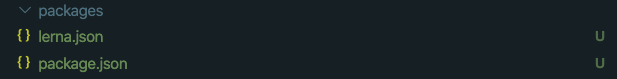
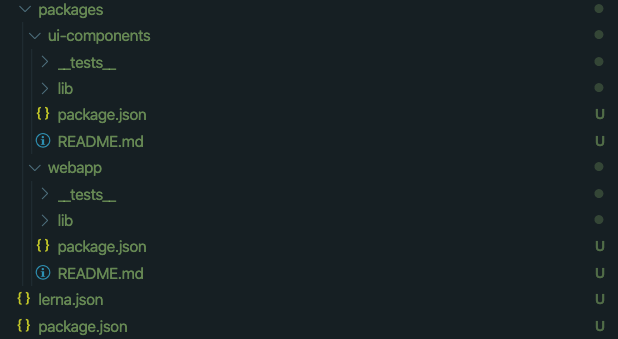
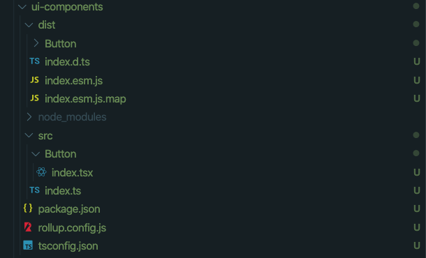

# Monorepo 구성해보기
  - Monorepo란?
  - Monorepo를 왜 쓸까?
  - Monorepo를 구현하기 위해서 *yarn*과 *lerna*를 사용!
  - 구현해보기  

---

## Monorepo가 뭘까요?

> Monorepo는 multirepo 와 달리 하나의 Repository에서 여러개의 Package를 관리하는 것을 말합니다.

---

## Monorepo를 왜 사용할까요?

-  공통적인 설정들을 하나로 처리하고 쉽게 공유가능
-  패키지간 공유가 가능합니다.
-  단일 이슈 트래킹
  ...
  
---

### 하지만 단점도 있음!

> Repository가 무거워 질 수 있고 build 할 때 패키지 전부 실행시켜야 하기 떄문에 오래걸리기도 하고...

그렇지만 아직 겪어보지 않았기에 잘 모르겠음.

---

## Monorepo를 구현하기 위해서 *yarn*과 *lerna*를 사용!

---

### yarn을 사용하는 이유?

> yarn은 monorepo를 위한 workspace를 제공하기 떄문!

- yarn은 패키지에 모듈을 설치 할 때 설치 할 module 들을 root/node_modules로 hoisting 시킵니다.
- 그리고 각 패키지들은 symblic link를 통해 root/node_modules 내 module을 사용할 수 있습니다.
- 이렇게 되면 같은 버전을 사용하는 모듈을 동일하게 바라보고 사용할 수 있다는 장점이 있습니다.
- 만약 버전이 다른 같은 모듈이라면 

---
### Symbolic link란?
> 원본 파일을 실행시키는 바로가기 파일

- 패키지 내 node_modules에는 .bin 폴더만 남게 되는데 이 .bin 폴더 내에 있는 파일이 바로가기 파일입니다.
- 패키지 내에서 특정 모듈을 실행시킬 때 아래 처럼 실행시킬 수 있는데요.
  ```bash
    ./node_modules/.bin/tsc init
  ```
- 이 bin 폴더에 있는 tsc 파일은 root/node_modules/tsc 파일(원본)을 실행시키게 됩니다.
---
## lerna를 사용하는 이유?

> yarn 만으로는 특정 패키지의 버전관리, changelog, 배포(npm publish)등을 할 수 없기 떄문!

- lerna version
- lerna-changelog
...

등을 통해 각 패키지별 버전, changelog 등 관리가 가능.

---

# 만들어 보기

---

# Yarn, lerna 설치하기
  - yarn 설치
  ```bash
    npm install -g yarn 
  ```
  - lernal 설치
  ```bash
    npx lerna init
  ```
  <br>

  

--- 

# package.json 설정

  ```json
  {
    "name": "root",
    "private": true, // yarn workspace를 사용하려면 설정해줘야 함.
    "devDependencies": {
      "lerna": "^4.0.0"
    },
    "workspaces": [ // yarn workspace 설정
      "frontend/*"
    ]
  }
  ```

---

# lerna.json 설정

  ```json
  {
    "version": "independent", // 독립적으로 패키지 버전관리를 하겠음.
    "npmClient": "yarn", // npm client로 yarn을 사용하겠음.
    "useWorkspaces": true // workspace를 사용하겠음.
  }

  ```

---

# lerna create [package-name]
> 패키지 생성

```bash
npx lerna create webapp
npx lerna create ui-components
```



---

# 공용으로 사용할 모듈 설치 및 configuration 생성

- typescript 설치
  ```bash
    yarn add -W -D typescript
  ```
- tsconfig.json 생성
  ```bash
    npx tsc init
  ```

---

# tsconfig.json 설정

```json
{
  "compilerOptions": {
    "target": "ESNext",  // javascript 언어 버전 설정
    "moduleResolution": "node", // module 처리 방식 설정
    "allowSyntheticDefaultImports": true,  // default export가 없는 모듈을 default import 하는 것을 허용 
    "esModuleInterop": true, // cjm 모듈 호환
  },
  "exclude": ["node_modules"]
}

```

--- 

# ui-components 패키지 설정

> React Component Lib

- install rollup, rollup-plugin-typescript2, @types/react, react
- rollup.config.js 생성 및 설정
- tsconfig.json 생성 및 설정
- package.json 설정

---

# [ui-components] 모듈 설치

```bash
yarn workspace ui-components add -D rollup rollup-plugin-typescript2, @types/react

yarn workspace ui-components add react
```

---

# [ui-components] rollup.config.js 생성 및 설정

```javascript
import typescript from 'typescript';
import tsPlugin from 'rollup-plugin-typescript2';
import pkg from './package.json';

export default [
    {
        input: "src/index.ts",
        output: {
            file: pkg.module,
            format: 'esm',
            sourcemap: true,
        },
        plugins: [
            tsPlugin({ typescript })
        ]
    }
]
```

---

# [ui-components] package.json 설정

```json
{
  ...
  "scripts": {
    "build": "rollup -c"
  },
  "module": "dist/index.esm.js", // 배포된 모듈을 사용할 때 esm으로 가져올 경우 필요한 옵션
}
```

---

# [ui-components] tsconfig.json 생성 및 설정

```json
{
    "extends": "../../tsconfig.base.json", // 공용 config 상속
    "compilerOptions": {
        "module": "ESNext", // module 방식 설정
        "jsx": "react", // jsx 허용
        "declaration": true // .d.ts 파일 생성
    }
}
```

---

# [ui-components] 컴포넌트 생성

- Button.tsx
```typescript
import React from 'react'

type Props = {
    children: React.ReactNode;
}

function Button({ children }: Props) {
    return (
        <button type="button">{children}</button>
    )
}

export default Button
```

- index.ts
```typescript
export { default as Button } from './Button';
```

---

# [ui-components] build

- build
  ```bash
    yarn workspace ui-components build
  ```



---

# webapp 패키지 설정

- install parcel parcel-bundler react react-dom @types/react-dom
- package.json script 추가
- tsconfig.json 생성 및 설정
- ui-components 설치

---

# [webapp] 모듈 설치

```bash
  yarn workspace webapp add -D parcel parcel-bundler @types/react-dom

  yarn workspace webapp add react react-dom
```

---

# [webapp] package.json script 추가

```json
{
  ...
  "scripts": {
    "start": "parcel --port=3010 watch src/index.html"
  }
}
```

---

# [webapp] tsconfig.json 생성 및 설정

```json
{
    "extends": "../../tsconfig.base.json",
    "compilerOptions": {
        "jsx": "react",
        "module": "CommonJS"
    }
}
```

---

# [webapp] ui-components 설치

```bash
npx lerna add ui-components --scope=webapp
```

---

# [webapp] 실행

```bash
yarn workspace webapp start
```

---

# [번외] lerna version

---

# 끝